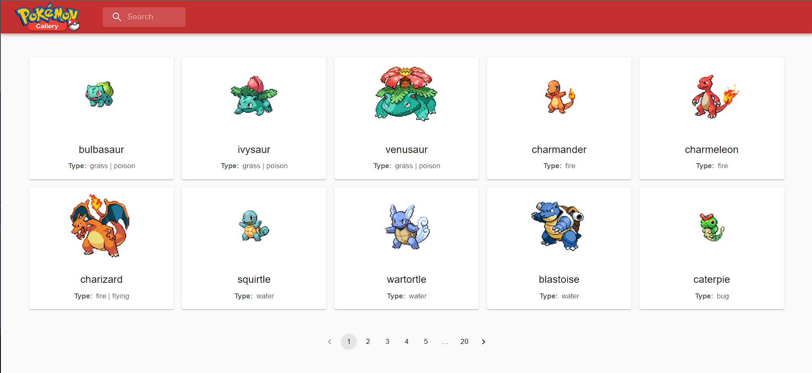

## Pokémon Gallery 🔴⚪🎖

> Under development ⏳

> 

> 

<!-- [🔗 Click here to access](https://tkoch97.github.io/github-favorites/) -->

## 🔧 Tecnologies

HTML CSS  JavaScript  React Node.js Material Ui Git

## 📪 Contact

>Email: tkoch.dev@gmail.com

>Linkedin: https://www.linkedin.com/in/tkoch97/

>Instagram: https://www.instagram.com/tkoch.dev/
